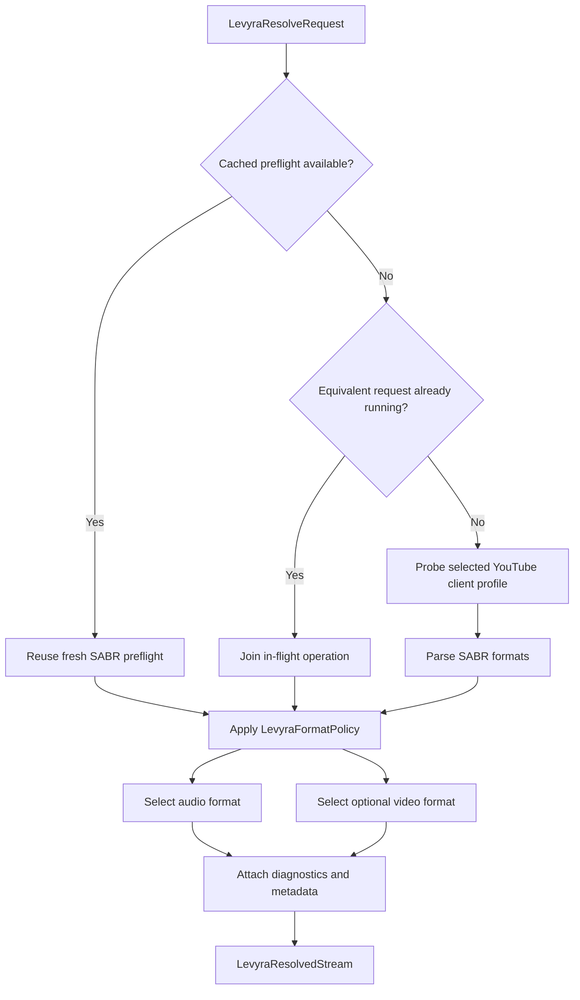

<div align="center">

# LevyraExtractor

### Resilient multi-service extraction built for the Levyra playback engine

[](https://github.com/LUC4N3X/LevyraExtractor/releases)
[](https://jitpack.io/#LUC4N3X/LevyraExtractor)
[](LICENSE)
[](https://openjdk.org/projects/jdk/17/)
[](https://gradle.org/)

**A hardened, Levyra-focused evolution of the NewPipe/PipePipe extractor stack.**  
Designed for reliable metadata extraction, direct media resolution, adaptive YouTube playback and production-grade diagnostics.

[Features](#-features) · [Installation](#-installation) · [Usage](#-quick-start) · [Architecture](#-architecture) · [Credits](#-credits--open-source-heritage) · [License](#-license)

</div>

---

## Overview

LevyraExtractor is the extraction and stream-resolution layer used by the **Levyra** music experience.

The project preserves the broad service support and mature parsing foundations of the NewPipe ecosystem while adding a dedicated Levyra resolver for modern YouTube playback scenarios. Its focus is not only obtaining metadata, but selecting a usable media path with explicit policies, bounded caching, in-flight request deduplication and actionable diagnostics.

This repository is a **modified downstream fork**. It is not an official NewPipe, PipePipe or Metrolist project.

## ✨ Features

### Levyra YouTube resolver

- Dedicated `LevyraYoutubeResolver` API for audio and video resolution.
- Android VR Innertube client support for direct stream discovery.
- SABR preflight probing for adaptive YouTube media paths.
- Audio selection based on bitrate, original-audio preference and container policy.
- Video selection based on maximum height, codec preference and bitrate.
- AV1, VP9 and AVC/H.264-aware ranking.
- Configurable MP4/M4A preference for compatibility-focused playback.
- Short-lived preflight cache to reduce repeated network work.
- In-flight request coalescing so concurrent requests for the same target share one operation.
- Resolution diagnostics including elapsed time, cache hits, joined requests and fallback reasons.

### Playback metadata

- SponsorBlock segment retrieval.
- Return YouTube Dislike statistics retrieval.
- Audio/video `itag` exposure.
- Selected source and fallback state exposure.
- Bootstrap URL support for SABR-oriented playback flows.

### Streaming-aware networking

- Buffered request compatibility through the classic downloader contract.
- Streaming `GET` and `POST` response support for large media payloads.
- Reduced peak-memory pressure when the host downloader overrides streaming methods.
- Async request support through cancellable calls.

### Multi-service extraction

| Service | Included |
| --- | :---: |
| YouTube | ✅ |
| SoundCloud | ✅ |
| Bandcamp | ✅ |
| PeerTube | ✅ |
| media.ccc.de | ✅ |
| BiliBili | ✅ |
| NicoNico | ✅ |

### Build and distribution

- Java 17 toolchain.
- Gradle multi-module project.
- Source JAR generation.
- Maven publication support.
- JitPack-ready build configuration.
- Separate `extractor` and `timeago-parser` modules.

## 🧠 Resolution flow



## 📦 Installation

### Requirements

- JDK 17
- Gradle-compatible JVM project
- A concrete `Downloader` implementation
- JitPack repository access when consuming published builds

### Gradle Kotlin DSL

Add JitPack to `settings.gradle.kts`:

```kotlin
pluginManagement {
    repositories {
        gradlePluginPortal()
        google()
        mavenCentral()
        maven("https://jitpack.io")
    }
}

dependencyResolutionManagement {
    repositoriesMode.set(RepositoriesMode.FAIL_ON_PROJECT_REPOS)
    repositories {
        google()
        mavenCentral()
        maven("https://jitpack.io")
    }
}
```

Add the extractor module to `build.gradle.kts`:

```kotlin
dependencies {
    implementation("com.github.LUC4N3X.LevyraExtractor:extractor:v1.0.0-levyra.6")
}
```

### Gradle Groovy DSL

Add JitPack to `settings.gradle`:

```groovy
pluginManagement {
    repositories {
        gradlePluginPortal()
        google()
        mavenCentral()
        maven {
            url "https://jitpack.io"
        }
    }
}

dependencyResolutionManagement {
    repositoriesMode.set(RepositoriesMode.FAIL_ON_PROJECT_REPOS)
    repositories {
        google()
        mavenCentral()
        maven {
            url "https://jitpack.io"
        }
    }
}
```

Add the extractor module to `build.gradle`:

```groovy
dependencies {
    implementation "com.github.LUC4N3X.LevyraExtractor:extractor:v1.0.0-levyra.6"
}
```

> Replace the version with the tag required by your application. The coordinates above match the publication configuration currently declared by this repository.

## 🚀 Quick start

The host application provides its concrete `Downloader` implementation through dependency injection. The following client is complete and can be copied into a Java project:

```java
import org.schabi.newpipe.extractor.NewPipe;
import org.schabi.newpipe.extractor.downloader.Downloader;
import org.schabi.newpipe.extractor.localization.ContentCountry;
import org.schabi.newpipe.extractor.localization.Localization;
import org.schabi.newpipe.extractor.levyra.LevyraResolveRequest;
import org.schabi.newpipe.extractor.levyra.LevyraResolvedStream;
import org.schabi.newpipe.extractor.levyra.LevyraYoutubeResolver;
import org.schabi.newpipe.extractor.services.youtube.sabr.YoutubeSabrClientProfile;

import java.util.Objects;

public final class LevyraExtractorClient {
    private final LevyraYoutubeResolver resolver;

    public LevyraExtractorClient(Downloader downloader) {
        Downloader requiredDownloader = Objects.requireNonNull(downloader, "downloader");
        Localization localization = new Localization("it", "IT");
        ContentCountry country = new ContentCountry("IT");

        NewPipe.init(requiredDownloader, localization, country);
        NewPipe.setYoutubePlayerClient("android_vr");
        resolver = new LevyraYoutubeResolver(requiredDownloader);
    }

    public LevyraResolvedStream resolveAudio(String videoId) {
        LevyraResolveRequest request = LevyraResolveRequest
                .forVideoId(videoId)
                .setVideoMode(false)
                .setRequireStreamingDownloader(true)
                .setPreferMp4Audio(true)
                .setProfile(YoutubeSabrClientProfile.ANDROID_VR)
                .build();

        LevyraResolvedStream result = resolver.resolveSabrPreflight(request);

        if (!result.isResolved()) {
            String reason = result.getDiagnostics().getFallbackReason();
            throw new IllegalStateException(
                    reason.isEmpty() ? "Unable to resolve the requested audio stream" : reason
            );
        }

        return result;
    }

    public LevyraResolvedStream resolveVideo(String videoId, int maxVideoHeight) {
        LevyraResolveRequest request = LevyraResolveRequest
                .forVideoId(videoId)
                .setVideoMode(true)
                .setRequireStreamingDownloader(true)
                .setPreferMp4Audio(false)
                .setMaxVideoHeight(maxVideoHeight)
                .setProfile(YoutubeSabrClientProfile.ANDROID_VR)
                .build();

        LevyraResolvedStream result = resolver.resolveSabrPreflight(request);

        if (!result.isResolved()) {
            String reason = result.getDiagnostics().getFallbackReason();
            throw new IllegalStateException(
                    reason.isEmpty() ? "Unable to resolve the requested video stream" : reason
            );
        }

        return result;
    }
}
```

Example usage after constructing the client with the downloader used by the host application:

```java
LevyraExtractorClient client = new LevyraExtractorClient(downloader);
LevyraResolvedStream stream = client.resolveAudio("dQw4w9WgXcQ");

String audioUrl = stream.getAudioUrl();
int audioItag = stream.getAudioItag();
long elapsedMs = stream.getDiagnostics().getElapsedMs();
```

## 🔌 Downloader contract

Every integration must supply a concrete subclass of:

```text
org.schabi.newpipe.extractor.downloader.Downloader
```

For the lowest memory overhead during SABR and other large transfers, override the streaming methods instead of relying on the buffered compatibility implementation:

```java
public StreamingResponse getStreaming(
        String url,
        Map<String, List<String>> headers,
        Localization localization
) throws IOException, ReCaptchaException
```

```java
public StreamingResponse postStreaming(
        String url,
        Map<String, List<String>> headers,
        byte[] dataToSend,
        Localization localization
) throws IOException, ReCaptchaException
```

The caller owns the returned stream and must close it.

## 🏗 Architecture

```text
LevyraExtractor/
├── extractor/
│   ├── core extraction contracts
│   ├── service implementations
│   ├── YouTube Innertube clients
│   ├── SABR probing and session support
│   ├── SponsorBlock integration
│   └── Levyra resolver API
├── timeago-parser/
│   └── localized relative-time parsing
├── build.gradle
├── settings.gradle
├── jitpack.yml
└── LICENSE
```

### Main Levyra API

| Type | Responsibility |
| --- | --- |
| `LevyraResolveRequest` | Immutable resolution input with builder-based configuration |
| `LevyraYoutubeResolver` | Coordinates preflight, caching, metadata and final resolution |
| `LevyraSabrPreflight` | Normalized representation of discovered SABR formats |
| `LevyraFormatPolicy` | Scores and selects audio/video candidates |
| `LevyraResolvedStream` | Final URLs, formats, metadata and source state |
| `LevyraResolveDiagnostics` | Timing, cache, in-flight and fallback visibility |
| `LevyraSponsorBlockSegment` | SponsorBlock segment value object |

## 🛠 Building locally

### Linux and macOS

```bash
chmod +x gradlew
./gradlew clean build
```

### Windows PowerShell

```powershell
.\gradlew.bat clean build
```

### Publish to Maven Local

```bash
./gradlew clean publishToMavenLocal -x test -x check
```

The JitPack build uses OpenJDK 17 and publishes every Java component configured by the project.

## ⚙️ Configuration reference

### Supported YouTube player client values

The global player-client selector accepts:

```text
android_vr
mweb
web_safari
tv_downgraded
```

Invalid values fall back to `android_vr`.

### SABR client profiles

The dedicated SABR resolver currently exposes:

```text
WEB
MWEB
WEB_EMBEDDED
ANDROID
ANDROID_VR
IOS
TVHTML5
```

### Default Levyra resolver behavior

| Option | Default |
| --- | --- |
| Video mode | `false` |
| Streaming downloader required | `true` |
| Prefer MP4 audio | `false` |
| Maximum video height | `1080` |
| SABR client profile | `ANDROID` |
| Localization | Extractor default |
| Content country | Extractor default |
| Preflight cache lifetime | `90 seconds` |

## 🔐 Production notes

- Network extraction depends on upstream services and can break when those services change their internal APIs or page structures.
- A host application should implement timeouts, cancellation, retries, request limits and observability in its downloader.
- Prefer true streaming responses for large SABR payloads to avoid buffering complete media batches in memory.
- Review `NewPipe.trustEveryone()` before production use. In the current source tree it installs permissive global TLS verification when `NewPipe.init()` is called.
- Never log authentication cookies, visitor data, tokens, complete request headers or signed media URLs.
- Respect service terms, copyright rules and applicable law in the environments where this library is used.

## 🤝 Contributing

Contributions should remain focused, reviewable and compatible with the extractor's public contracts.

1. Create a branch from the current development base.
2. Keep changes scoped to one concern.
3. Add or update tests for parser and resolver behavior.
4. Run the complete Gradle verification pipeline.
5. Document externally visible behavior changes.
6. Open a pull request with reproduction steps and validation results.

When modifying upstream-derived files, preserve existing copyright and license headers.

## 🙏 Credits & open-source heritage

LevyraExtractor exists because of the work of many open-source developers. The project intentionally preserves its lineage and does not claim authorship of upstream code.

### Core lineage

| Project | Contribution to this repository |
| --- | --- |
| [NewPipeExtractor](https://github.com/TeamNewPipe/NewPipeExtractor) by Team NewPipe | Original extraction architecture, service contracts, parsers and a substantial part of the codebase |
| [NewPipe](https://github.com/TeamNewPipe/NewPipe) by Team NewPipe | The application and ecosystem for which NewPipeExtractor was created |
| [PipePipe](https://codeberg.org/NullPointerException/PipePipe) | Extended downstream ecosystem and the direct origin identified by the original repository README |
| [PipePipeExtractor](https://github.com/InfinityLoop1308/PipePipeExtractor) | Extractor fork forming the downstream lineage used by PipePipe-derived projects |
| [MetrolistExtractor](https://github.com/MetrolistGroup/MetrolistExtractor) | Reference implementation and upstream inspiration for modern playback/client handling, including the Android VR extraction direction adopted by Levyra |
| [Metrolist](https://github.com/MetrolistGroup/Metrolist) | Open-source YouTube Music client ecosystem whose extractor work informed Levyra's playback compatibility work |

### Original authors and contributors

Special recognition goes to **Christian Schabesberger** and all past and present **Team NewPipe**, **PipePipe**, **Metrolist** and downstream contributors whose copyright notices, commits and design work remain part of this codebase.

The complete and authoritative contributor history belongs to the upstream repositories and their Git histories. This README supplements rather than replaces the copyright notices preserved in individual source files.

### Services and community APIs

| Project | Use |
| --- | --- |
| [SponsorBlock](https://github.com/ajayyy/SponsorBlock) | Community-maintained skip-segment data |
| [Return YouTube Dislike](https://github.com/Anarios/return-youtube-dislike) | Community-provided like/dislike statistics |
| [JitPack](https://jitpack.io/) | Build and Maven distribution infrastructure |

### Main third-party libraries

| Library | Purpose |
| --- | --- |
| [nanojson](https://github.com/mmastrac/nanojson) / TeamNewPipe fork | Lightweight JSON parsing |
| [jsoup](https://jsoup.org/) | HTML parsing and traversal |
| [OkHttp](https://square.github.io/okhttp/) | HTTP client primitives |
| [Wire](https://square.github.io/wire/) | Protocol Buffer code generation |
| [Protocol Buffers](https://github.com/protocolbuffers/protobuf) | Structured message serialization |
| [Java-WebSocket](https://github.com/TooTallNate/Java-WebSocket) | WebSocket transport |
| [AutoLink](https://github.com/robinst/autolink-java) | URL and link detection |
| [Brotli](https://github.com/google/brotli) | Brotli decoding support |
| [Apache Commons Lang](https://commons.apache.org/proper/commons-lang/) | General-purpose Java utilities |
| [Apache Commons Codec](https://commons.apache.org/proper/commons-codec/) | Encoding and digest utilities |
| [SpotBugs Annotations](https://spotbugs.github.io/) | Static-analysis annotations |
| [JSON-java](https://github.com/stleary/JSON-java) | Optional JSON compatibility API |

All names, trademarks, source code and libraries remain the property of their respective authors and are distributed under their own applicable licenses.

## ⚖️ Disclaimer

LevyraExtractor is an independent open-source project. It is not affiliated with, authorized by, maintained by, sponsored by or endorsed by Google LLC, YouTube, SoundCloud, Bandcamp, PeerTube, BiliBili, NicoNico, Team NewPipe, PipePipe or Metrolist.

YouTube and all other referenced product names and trademarks belong to their respective owners.

## 📄 License

This repository is distributed under the **GNU General Public License v3.0**.

You may use, study, modify and redistribute the software under the conditions of the GPLv3. Modified distributions must preserve the applicable notices, provide the corresponding source code and clearly identify their changes.

See [`LICENSE`](LICENSE) for the complete license text.

---

<div align="center">

**Engineered for Levyra by [LUC4N3X](https://github.com/LUC4N3X)**  
Built on the shoulders of the NewPipe, PipePipe and Metrolist open-source communities.

</div>
